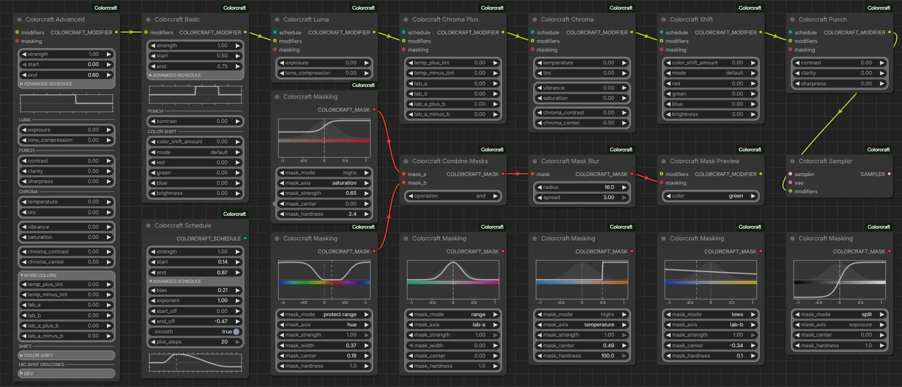

# Colorcraft

### Color grading for ComfyUI, applied where it actually matters: inside the diffusion process itself.

Colorcraft is a set of modular nodes that chain together, letting you build your own custom color-editing pipeline out of modifiers, schedules, and masks. Letting you mix and match exactly what a shot needs. 

Between the axes and masks on offer, it's close to the full toolset of something like Lightroom or Camera Raw... applied somewhere those guys could never reach: mid-generation, in latent space.

Exposure, Contrast, Tone Mapping, Saturation et al., White Balance/Tint, Hue Shifting, Split-toning and Cross-processing effects, and specifically targeted versions of those, all done without LoRAs, prompt hijinks, CFG boost, post-processing effects etc., just using pure vector math on the latent.

And since it's just simple vector math, **it's computationally close to free!**

<!-- TODO: hero image — assets/hero.png -->
<!--  -->

## Why not just do it in post?

Most color tools work on a finished image after the fact: a curve, a LUT, a filter laid over pixels that are already locked in. Colorcraft reaches into the latent while the image is still being formed, and shapes color the same way the model itself does, along real, meaningful axes of the space it thinks in, rather than the red/green/blue channels of a decoded image. 

It's the difference between metering a shot correctly at capture versus fixing the exposure afterward, or mixing the right color on the palette versus color-correcting a finished painting. Latents carry far more dynamic range than a decoded image, so there's real headroom to work with: proper HDR-range color, not a clipped approximation of it. 

And because the edit happens while the image is still forming, it doesn't just recolor the result: it can steer the generation itself (e.g. making darker, brighter, or more colorful compositions than the model would produce on its own). You can even push or pull fine detail and texture directly, something no post-process filter can genuinely add back once it's gone.

Oh, and also, you won't need a second software or process. You do it all in one go.

## What you get


- **Basic** — contrast and color shift, works on any model
- **Advanced** — the full toolkit in one mega-node
- **Luma** — exposure, tone compression
- **Chroma** — temperature, tint, vibrance, saturation, chroma contrast
- **Chroma Plus** — the finer diagonal color axes, for when temperature/tint isn't enough
- **Punch** — contrast, clarity, sharpness
- **Shift** — push/pull colors towards a specifically defined color
- **Schedule** — build one schedule and share it across several modifiers, or use different schedules for different modifiers
- **Masking** — key any edit by color, luminance, or hue
- **Mask Blur** — blur masks and control the spread (grow/shrink)
- **Combine Masks** — build up complex, compound masks from simple ones
- **Mask Preview** — tiny helper node for visualizing masks
- **Sampler** — the actual workhorse. Chain together whatever modifiers you want, feed the last one into this, and pass it to a SamplerCustom node in place of your regular sampler

<!-- TODO: gallery — assets/gallery/ -->
<!-- before/after comparisons -->

## Requirements

- ComfyUI
- **Basic** node should work with any model that has a VAE, no restrictions
- Every other node needs colour axes matched to the model's image encoder. Currently supported:
  - **Krea2** / **Qwen Image** / etc.
  - **Z-Image** / **Flux** / etc.
  - **Flux2 Klein** — see [Which models it works with](#which-models-it-works-with)

Colorcraft's color axes go by image encoder, not by checkpoint, so any model sharing one of the encoders above is covered automatically (that's the "etc."). 

That being said, I have only tested Krea2, Z-Image and Flux2 Klein. So, feedback would be much appreciated on how it fares with **Anima**, **Qwen Image**, and other models.

Other encoders — **Mugen**, SDXL — may follow. Each needs its own set of axes worked out first.

## Installation

### ComfyUI

**Via ComfyUI Manager:** 
Open Manager → **Install via Git URL** → paste `https://github.com/muerrilla/ComfyUI-Colorcraft` → Confirm.

**Manually:**
```
cd ComfyUI/custom_nodes
git clone https://github.com/muerrilla/ComfyUI-Colorcraft.git
```
Restart ComfyUI and refresh your browser. The nodes appear under **Muerrilla → Colorcraft** in the node menu.

### WebUI Forge Neo

The same repo doubles as a Forge Neo (`sd-webui-forge-classic`) extension — see [Forge Neo](#forge-neo) below for what it covers.

```
cd webui/extensions
git clone https://github.com/aoleg/ComfyUI-Colorcraft.git
```
Restart the webui. Colorcraft appears as an accordion on both the txt2img and img2img tabs.

## Getting started

Colorcraft works through a custom sampler. So drop in the `Colorcraft Sampler` node, plug in the required VAE and sampler (`KSamplerSelect`), and plug it into a `SamplerCustom` node. 

Build out from there, chaining together the modifiers of your liking and feeding them into `Colorcraft Sampler`. (e.g. `Colorcraft Luma` for adjusting exposure → `Colorcraft Punch` for adjusting contrast → `Colorcraft Sampler`)

Every modifier node (except `Colorcraft Basic` and `Colorcraft Advanced`) requires a `Colorcraft Schedule` input, defining the sampling steps to which the modifier applies.

Additionally, every modifier node (except `Colorcraft Basic`) can take an optional mask through the `masking` input.

## Workflows

A handful of basic example workflows are included in `workflows/` folder. Drop any of them straight into ComfyUI to get oriented. A wider set covering the more advanced adjustments and masking/scheduling tricks is coming shortly.

**Note:** The example workflows are all based on Krea2. You can change the Diffusion Model, CLIP, and VAE to make them work with Z-Image or any other model that uses either Qwen Image VAE or Flux AE. You might have to re-adjust the modifier sliders to get the same adjustment intensities for different models.

## Tips

- **Timing is key:** every adjustment rides its own schedule across the sampling steps. Push it early and it steers the generation; hold it for the later steps and it behaves like straightforward color correction, faithful to what was already forming.

- **Be gentle, or give the model time to heal:** If your edits are too strong, they will eventually break the latent and create artifacts. In those cases you'd better spread the edit across multiple steps and/or avoid applying the edit on the last few steps, giving the model some time to recover. **In general, try to avoid applying edits on the very last step (unless the edit is *very* mild).**

- **Every adjustment can be gated by a mask:** not a hand-painted region, but a live read of the image's own color, luminance, or hue. So, besides things like adjusting only the shadows or highlights, an edit can target "the warm highlights" or "everything except skin tones" using combined masks.

## Forge Neo

Colorcraft also runs as an extension for **WebUI Forge Neo**. It does exactly the same thing to your image as the ComfyUI nodes do — it's the same code underneath — but instead of wiring up a graph you get a single panel.

### Using it

Open the **Colorcraft** panel on the txt2img or img2img tab and tick it on. Top to bottom, the panel is:

- **Schedule** — which part of the generation your adjustment applies to. This matters more than you'd think: applied early, an adjustment steers what the image becomes; applied late, it corrects the image that already formed.
- **The adjustments themselves** — exposure, contrast, temperature, tint, saturation, clarity and the rest. The extra sections (More colors, Color shift, Advanced) are switches that reveal the deeper controls when you want them.
- **Masking** — restrict the adjustment to part of the picture, chosen by the picture's own colour, brightness or hue rather than by painting a region. Tick **Mask preview** to see what you're actually selecting.

Your **Sampling method** and **Schedule type** keep working normally — Colorcraft doesn't replace the sampler, it just adjusts the image as the sampler goes.

Start small. The amount sliders run −1 to +1, and even a third of that is a visible change, because the adjustment is applied at every step in its window rather than once. If something looks broken or blotchy, you've gone too hard: either turn it down, or spread it over more steps and stop before the last one so the model has room to settle.

### What the panel does and doesn't cover

It gives you one adjustment, one schedule, and one mask — which between them reach every colour axis in the pack.

Three things the node version can do that the panel currently can't, because they need a graph to express:

- stacking several different adjustments, each on its own schedule;
- masks built from more than two parts;
- blurring one part of a mask but not the other (the blur applies to the finished mask).

### Which models it works with

Colorcraft works by nudging the image along colour directions that are specific to the model's image encoder — so support goes by encoder, not by checkpoint. If your model shares an encoder with one below, it's covered:

| Works with | Also covers |
|---|---|
| **Krea 2** | Qwen-Image, Anima, Wan 2.1 |
| **Z-Image** | Flux, Lumina2, Chroma |
| **Flux2 Klein** | — |

On anything else — SD 1.5, SDXL, Mugen — **Contrast** and **Color shift** still work, and everything else quietly does nothing. The log says so once when it happens, so check there if a generation comes out unchanged.

One honest note about **Flux2**. The colour directions for Krea 2 and Z-Image come from the original author of Colorcraft. Flux2's don't exist upstream, so they were worked out here, from the model's own encoder. They're real — each one does what its label says, and the method was checked by re-deriving the two known models first and comparing — but they aren't the author's, so a given slider value can feel a bit different on Flux2 than on the other two. Its strengths were matched to Z-Image by eye-level effect rather than by raw numbers, so the sliders should at least be in the same ballpark across models.

Only Krea 2 and Z-Image were tuned by the original author. Other models sharing those encoders inherit those numbers and may want somewhat different slider values.

### Your settings don't persist — your images carry them

Colorcraft deliberately doesn't save its ~60 controls as webui defaults; they're per-image choices, not preferences, and the panel comes back at its defaults each session.

Instead, whatever you set is written into the generated PNG. Drag that image back into the webui, or use send-to-txt2img, and the whole panel is restored — including clearing anything the saved look didn't set. So an image you liked is always enough to get back to how you made it.

### Under the hood

If you're modifying the extension rather than using it, [DEVNOTES.md](DEVNOTES.md) covers where it hooks into Forge, how the shared code is laid out, how the colour directions for a new model are derived, and how to run the test suite.

## Limitations

The nodes are designed for the classic UI. Nodes 2.0 is not supported until there's at least some dev docs for it.

## Credits

The sigma-to-step handling is adapted from Jonseed's ComfyUI port of Detail Daemon: https://github.com/Jonseed/ComfyUI-Detail-Daemon
